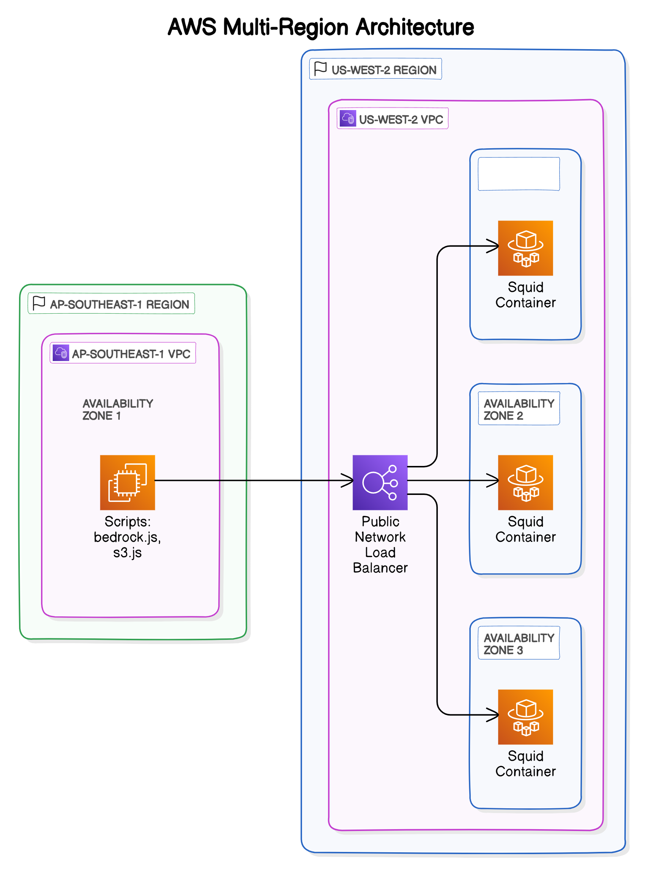

# AWS SDK Proxy Over ECS

This project demonstrates how to deploy a Squid proxy on AWS ECS Fargate with a Network Load Balancer using AWS CDK. The solution enables AWS SDK clients to make API calls through a centralized proxy, which is particularly useful for cross-region access patterns and centralized egress control.



## Key Benefits

- **Centralized Egress Control**: Manage and monitor all outbound AWS API calls through a single proxy
- **Cross-Region Access**: Access AWS services in one region from resources in another region
- **Simplified Security Management**: Apply consistent security policies to all AWS API traffic
- **Enhanced Monitoring**: Gain visibility into AWS API call patterns across your organization
- **Infrastructure as Code**: Complete CDK implementation for repeatable deployments

## Architecture Overview

The solution deploys a Squid proxy server on AWS ECS Fargate behind a Network Load Balancer. The architecture enables secure outbound connections to AWS services through a centralized proxy.

Key components:

- VPC with configurable CIDR and Availability Zones
- ECS Cluster running on Fargate
- Squid Proxy containers (Ubuntu/Squid)
- Network Load Balancer (public or private)
- Security Groups for access control
- NAT Gateway for outbound internet access

The flow:

1. AWS SDK clients connect to the Network Load Balancer
2. Traffic is distributed across Squid proxy containers
3. Proxy containers handle outbound requests to AWS services
4. Responses return through the same path

## Prerequisites

- AWS CLI installed and configured
- Node.js 14.x or later
- AWS CDK CLI installed (`npm install -g aws-cdk`)

If you haven't used AWS CDK before, please follow the [AWS CDK Getting Started Guide](https://docs.aws.amazon.com/cdk/v2/guide/getting_started.html) first.

## Installation

1. Clone this repository
2. Install dependencies:

```bash
cd proxy
npm install
```

## Configuration

The stack can be configured through the `cdk.json` file in the `context` section under `proxy-config`:

### VPC Configuration

```json
{
  "proxy-config": {
    "vpc": {
      "cidr": "10.2.0.0/16",
      "maxAzs": 3
    }
  }
}
```

Example values:

- CIDR: "172.16.0.0/16", "192.168.0.0/16"
- maxAzs: 1, 2, or 3

### Load Balancer Configuration

```json
{
  "proxy-config": {
    "loadBalancer": {
      "isPublic": false
    }
  }
}
```

You can override these configurations using CDK context parameters:

```bash
# Deploy with different VPC CIDR
cdk deploy -c proxy-config.vpc.cidr=172.16.0.0/16

# Deploy with public load balancer
cdk deploy -c proxy-config.loadBalancer.isPublic=true
```

## Deployment

1. Bootstrap CDK (first time only):

```bash
cdk bootstrap
```

2. Deploy the stack:

```bash
cdk deploy
```

After deployment, the proxy endpoint URL will be displayed in the outputs.

## Using the Proxy with AWS SDK

The example scripts demonstrate how to use AWS SDK through the proxy:

### S3 Example

```javascript
const { S3Client, ListBucketsCommand } = require("@aws-sdk/client-s3");
const { HttpsProxyAgent } = require("https-proxy-agent");

const client = new S3Client({
  region: "us-west-2",
  httpAgent: new HttpsProxyAgent("http://your-nlb-dns:3128"),
  httpsAgent: new HttpsProxyAgent("http://your-nlb-dns:3128"),
});

// Use the client to make API calls
const command = new ListBucketsCommand({});
const response = await client.send(command);
```

### Bedrock Example

```javascript
const {
  BedrockRuntimeClient,
  ConverseStreamCommand,
} = require("@aws-sdk/client-bedrock-runtime");
const { HttpsProxyAgent } = require("https-proxy-agent");

const client = new BedrockRuntimeClient({
  region: "us-east-1",
  httpAgent: new HttpsProxyAgent("http://your-nlb-dns:3128"),
  httpsAgent: new HttpsProxyAgent("http://your-nlb-dns:3128"),
});

// Use the client to make API calls
const command = new ConverseStreamCommand({
  modelId: "amazon.nova-pro-v1:0",
  messages: [{ role: "user", content: [{ text: "tell me a joke" }] }],
  inferenceConfig: { maxTokens: 512, temperature: 0.7, topP: 0.9 },
});

const response = await client.send(command);
```

To run the examples:

```bash
cd example/squid-proxy
npm install
node s3.js
node bedrock.js
```

## Security Considerations

- **Network Security**: Configure security groups to restrict access to the proxy
- **Authentication**: Consider implementing authentication for the proxy
- **Encryption**: Ensure traffic between clients and the proxy is encrypted
- **Logging**: Enable access logging for audit and compliance purposes
- **IAM Permissions**: Use least privilege permissions for the ECS tasks
- **Regular Updates**: Keep the Squid proxy software updated
- **Monitoring**: Implement CloudWatch alarms for proxy health and performance

## Troubleshooting

- **Connection Issues**: Verify security group rules allow traffic on port 3128
- **Proxy Errors**: Check ECS task logs for Squid configuration issues
- **Performance Problems**: Consider scaling up the Fargate task CPU/memory
- **DNS Resolution**: Ensure the client can resolve the NLB DNS name
- **AWS SDK Errors**: Verify the proxy URL format in the SDK configuration

## Limitations

- Default VPC CIDR is 10.2.0.0/16 with 3 availability zones
- Load balancer is private by default
- The proxy runs on port 3128
- Make sure your AWS credentials have the necessary permissions for AWS Services
